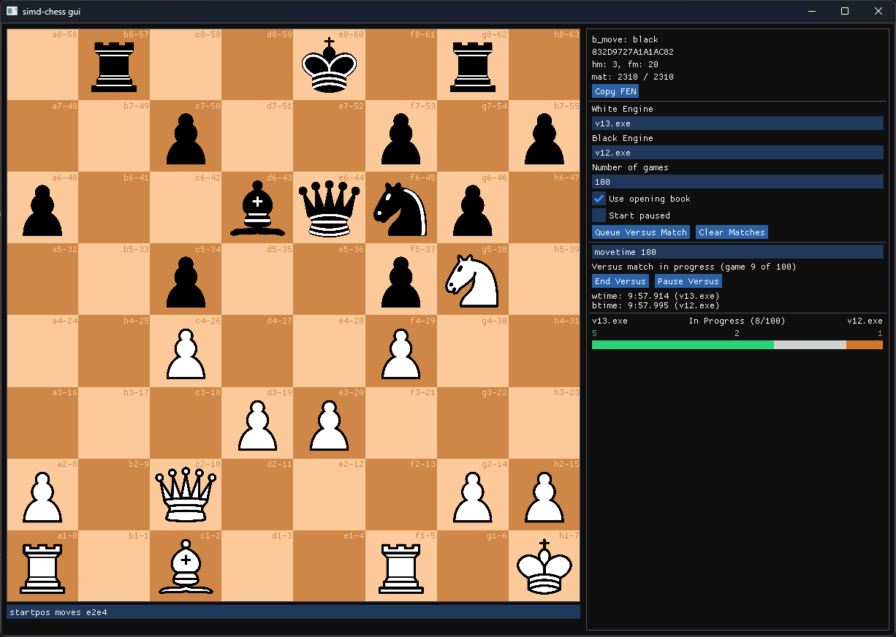

## simd-chess

simd-chess is a chess engine with the primary aim of utilising specific hardware instructions to gain speed advantages over traditional engines. The main challenge and goal of this project is to accelerate an inherently sequential problem of searching a chess game tree with CPU data parallelism/simd instructions. Due to the consecutive nature of the search, the strongest engines run on the CPU instead of the GPU and typically optimize performance by attempting to branch (prune) off irrelevant continuations as early as possible. This is also the case with simd-chess, however simd-chess additionally attempts to take full advantage of the available hardware instruction on the x64 ISA up to and including avx512. While these simd instructions enable faster processing of additions and multiplications required for running the NNUE neural network for evaluation, more interestingly they also enable some other localised optimizations in other parts of the engine such as move generation and sorting.

The main (and currently only) compilation target of the project is avx512 compatible processors such as AMD and Intel. For AMD processors it is recommended to use Zen 5+ hardware for its [native 512-bit datapath](https://www.numberworld.org/blogs/2024_8_7_zen5_avx512_teardown/). The engine uses a [NNUE](https://en.wikipedia.org/wiki/Efficiently_updatable_neural_network) style neural network that is completely trained from selfplay against itself. The main search code is located in [search.rs](src/engine/search/search.rs) and board representation in [chess_v2.rs](src/engine/chess_v2.rs)

    

## Feature overview

### Engine

| Feature                | Status | Notes                                                                                            |
| ---------------------- | ------ | ------------------------------------------------------------------------------------------------ |
| UCI                    | ✅     |                                                                                                  |
| PV-Search w/ αβ bounds | ✅     | Incl. iterative deepening, quiescence search and typical pruning techniques like LMR, NMP, etc.. |
| Transposition table    | ✅     | 3-fold repetitions and fifty-move rule are also accounted for in the search                      |
| MVVLVA move ordering   | ✅     |                                                                                                  |
| NNUE evaluation        | ✅     | Supports a dual perspective network in the form of (768 -> H)x2 -> 1                             |
| Search threading       | TODO   |                                                                                                  |

### Toolchain

| Feature                                     | Keybind | Notes                                                                                             |
| ------------------------------------------- | ------- | ------------------------------------------------------------------------------------------------- |
| Interactive UI                              | ✅      | [imgui-rs](https://github.com/imgui-rs/imgui-rs), enabled with gui command `cargo run -r gui`     |
| Selfplay engine for neural network training | ✅      |                                                                                                   |
| Matchmaking system                          | ✅      |                                                                                                   |
| Unit tests                                  | ✅      | Incl. [perft](https://www.chessprogramming.org/Perft) style fuzztests for most important features |
